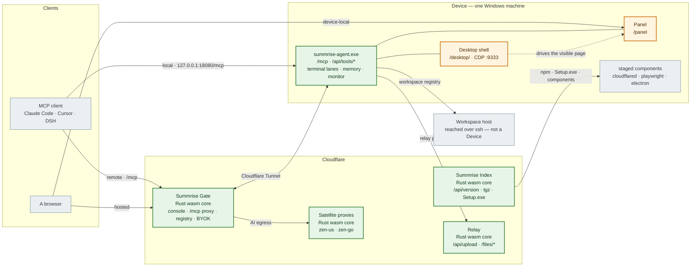

# Summrise

[](https://github.com/SilasVale/summrise/actions/workflows/ci.yml)

**A Windows machine you can hand to an AI.** Summrise runs a headless MCP server on a Windows 10/11 machine — the
*device* — and gives it a terminal (PTY / SSH / serial), a real browser, a memory store and a file relay. Reach it from a
local panel, from a hosted console (**Summrise Gate**) over a Cloudflare tunnel, or from any MCP client. One Rust binary,
one npm package, no cloud account required for local use.

## How it fits together

**Green is Rust** — natively in the agent, as wasm inside a Worker. **Amber is the thin shell a platform forces**:
a browser view, a Worker's entry, the Electron host, npm's `bin`. **Grey is not ours.** The rule this repository
follows: every *decision* is Rust, and JavaScript survives only where something else executes it.



The **Panel** is device-local and the only surface that can answer "what is this machine doing right now"; the
**Console** (inside Summrise Gate) reads devices and sessions from anywhere. A **workspace host** is reached over
ssh through a connection the agent saved — it is not a Device, and nothing about it is managed.

## Quick start (Windows)

**One file, no Node required** — [SummriseAgent-Setup.exe](https://agent.saisi.online/summrise-agent/SummriseAgent-Setup.exe).

**Or through npm** — the release host's version-free tarball, or the registry:

```powershell
npm.cmd i -g https://agent.saisi.online/summrise-agent/summrise-agent-latest.tgz   # .cmd shim: PowerShell's default policy blocks the .ps1 one
# npm.cmd i -g summrise-agent   # the registry instead — but a stale mirror's `latest` can install an OLDER CLI
summrise setup                 # install and start; the agent self-registers with the configured console on first start
summrise status                # `this CLI:` is the only proof of which one you got; npm's exit code is not
```

`setup` fetches the boxed components — `cloudflared.exe`, the Playwright runtime, the Electron runtime — from the
release host and verifies each against the sha256 pinned in [`version.json`](https://agent.saisi.online/summrise-agent/version.json).
They are deliberately **not** in the npm package: they are 54 MB, 31 MB and ~100 MB, and a device behind a filtered
network reaches the release host more reliably than it reaches the registry.

Then point an MCP client at the machine. This block is the payoff — the console generates the same one, with its own URL
and a per-device token:

```json
{ "mcpServers": { "summrise-agent": {
  "type": "http",
  "url": "http://127.0.0.1:18080/mcp",
  "headers": { "Authorization": "Bearer <device-token>" } } } }
```

The token is the device's own (`server.device_token`). The agent also serves its terminal panel at `/panel` and the
desktop shell at `/desktop/` — token entered once in the browser. Updating the machine, and reaching it from outside, are
both below.

## Highlights

- **Terminal that behaves** — OSC 633 shell integration (the VS Code approach): prompts and command boundaries arrive as
  invisible sequences, so the display stays clean and exit codes stay true. PTY, SSH and serial behind one surface.
- **A real browser, driven** — Playwright over CDP, plus an Electron shell whose UI an AI can drive.
- **Memory that persists** — a device-local knowledge base shared across every AI client, with multi-word search.
- **Reachable when you need it** — local panel by default; a console and a Cloudflare tunnel when a remote client needs in.

## What's in the box

| Directory | Project | Description |
|---|---|---|
| `agent/` | **Summrise Agent** | headless MCP server + `/api/tools` + panel + Electron desktop shell (`summrise-desktop-electron/`) + npm distribution (`summrise-agent-npm/`) |
| `gateway/` | **Summrise Gate** | console (login/roles), BYOK AI gateway, `/mcp` proxy to devices, device registry |
| `index/` | **Summrise Index** | download distribution (`summrise-dist`; hosts the npm tgz, see Quick start) |
| `proxies/` | **Satellite proxies** | zen-go / zen-us AI egress + api-relay (`./scripts/build.sh proxies`) |
| `brand/` | **Brand assets** | sunrise favicon / icon source (no build) |
| `scripts/` | build/release | unified build/publish entry (`build.sh`, `publish-release.sh`) |
| `docs/` | docs | the operator's charter (`docs/CHARTER.md`) and the agent inbox (`docs/agents/ideas.md`) |

## Build & deploy

```bash
# Windows cross-compile of summrise-agent (needs cargo-xwin)
./scripts/build.sh agent             # + panel SPA rebuild (embedded at compile time)

# Deploy the workers (needs a Cloudflare API token)
./scripts/build.sh gateway|index     # wrangler deploy the worker
./scripts/build.sh proxies           # deploy satellite proxy workers (zen-go / zen-us)
./scripts/build.sh api-relay         # build+deploy the VPS api relay (vrelay @ Oracle box)
./scripts/build.sh deploy            # build agent + deploy gateway/index + 2 CF proxies (not api-relay)

# CDN-publish a release (pack + stage + version.json sha256 + last-5 prune
# + deploy; then push + tag vX to get the CI-built GitHub release)
./scripts/publish-release.sh 1.2.N --npm   # --npm is OPT-IN: without it the CDN moves and the npm
                                          # CLI does not, so `npx summrise-agent` keeps serving the old
                                          # one. The script says so itself, and 1.2.453 deadlocked on it.
```

## License

MIT — see [LICENSE](LICENSE).
